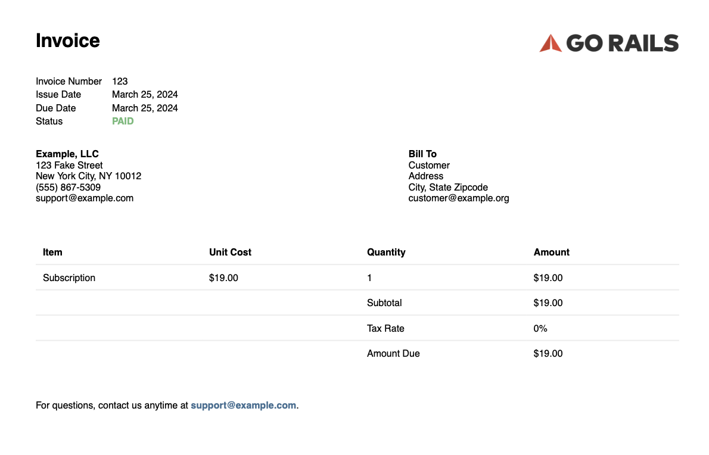
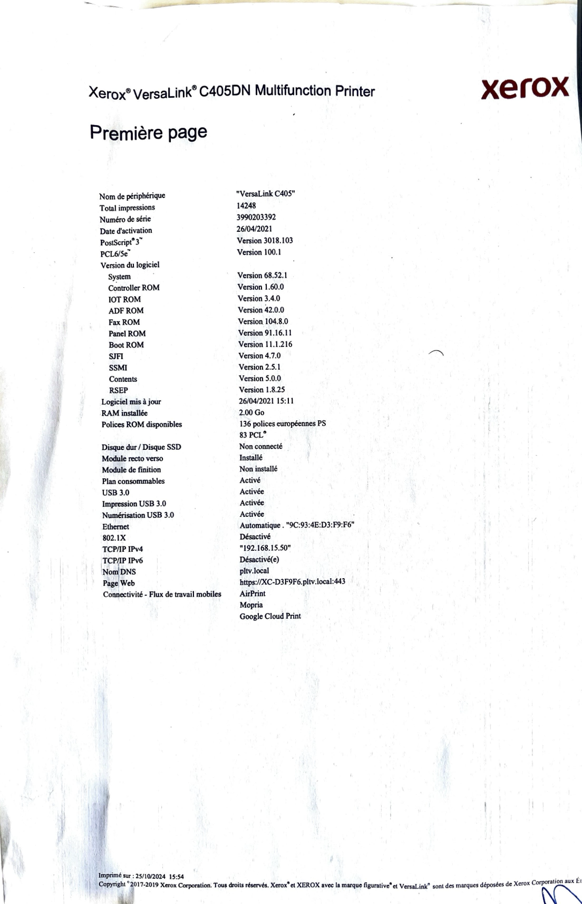

[//]: # (TODO: include images!!!!)

# <!-- _class: lead --> Parsing PDFs on a laptop or on-premise

## About this of session/presentation 
- part 1 insists on theory and favors knowledge sharing
- part 2 will happen later and will contain more live coding/practical examples 
- all presented tools are very well documented ➡️ you could get started after part 1
- why is part 1 so long: **the hardest part is choosing the right tool for the right type of PDF**
- it's dense: **feel free to reach out to me later**
- slides are a bit full, not ideal for presenting, but easier to use and share as standalone doc later on

## <!-- _class: lead --> Part 1: theory

## Why should I even care about local PDF parsing (in the LLM era)?
- LLMs often offer advanced doc parsing capabilities
- however, there are a few good reasons to use alternative approaches when possible 

### Confidentiality 🔒
- in many Data Journalism applications, it's not possible to send data to the cloud for confidentiality reasons
- it's often the case at ICIJ
- local (or on-premise) **alternatives to cloud APIs** are still **very relevant**

### Cost control 🤑 and ecological impact 🌏
- sometimes, very basic Python libs can perfectly handle PDFs 
- given the financial and environmental cost of LLMs 🔨🏭😶‍🌫️, there's no reason to use them when we can avoid it
- it's all the more important in **large-scale applications** when dealing with thousands/millions of pages of docs    

### Even LLM applications can require text inputs
- some LLMs applications require turning docs into text format first
- it's typically the case when performing **Retrieval-Augmented-Generation (aka [RAG](https://docs.mistral.ai/guides/rag/))**
- in RAG, docs are first converted to text (ideally Markdown) then indexed and embedded for vector (or hybrid) search
- for RAG: better PDF parsing ➡️ better doc embedding ➡️ better doc retrieval ➡️ better LLM answer 

### Avoiding hallucinations and aiming for reproducibility
- LLMs can get creative, they should be avoided when fidelity is key
- even when using a `seed` + `temperature=0` LLMs outputs are often [non-deterministic]((https://arxiv.org/pdf/2408.04667v5)) (due to batch processing and floating point operations)
- some level of reproducibility is important when you aim at improving something in a **stable** manner over time

## <!-- _class: lead --> Wait a bit, what's a PDF file 🤔?

### PDFs are meant to be visualized, not parsed

PDFs often contain:
- **a description** of elements to display in the PDF viewer. Think of it as **a set of instructions to write/draw the doc content on a whiteboard**. It describes what to write/draw and where to do it  
- **embedded files** (optional): hidden inside the PDF file itself, typically images
- **metadata**: author, name of the software which created the PDF, some security stuff, anything...
- **scripts** (optional): PDF can contain all sorts of malware ⚠️

### PDF parsing challenges
- PDFs are essentially descriptive
- there are often many ways to write/draw a document on a whiteboard to get to the exact same result: **no canonical form**
- some PDFs files **can be insanely complex**

➡️ **no simple or canonical way to parse PDFs**

### To go further
- [Wikipedia PDF article](https://en.wikipedia.org/wiki/PDF)
- *[Understanding the PDF file format](https://blog.idrsolutions.com/understanding-the-pdf-file-format/)*
- PDF file format [RFC](https://datatracker.ietf.org/doc/html/rfc7995) (PDF file format specification)

### The different "kinds" of PDFs

When it comes to parsing PDFs, we can roughly categorize docs in two different categories:
- **digital documents** (computer generated PDFs)
- **scans and images**

### Digital documents (computer generated PDFs)

---

- homemade term to designate any doc **originally created digitally** and **later saved/exported/converted as PDFs** to be shared
- text-oriented docs (often generated from Word, OpenOffice, Google Docs...)
- invoices, forms, contracts... (generated by programs)
- any doc created by a "Save as PDF", "Export as PDF"... functionality
---
- computer generated PDFs often contain a lot of **readable text** 
- computer generated PDFs are **generally well handled** by PDF parsing libs, performances can greatly vary depending on:
  - the software used to generate the PDF
  - PDF items of interest, while texts in paragraphs are usually easily read, other items are not trivial to parse even in digital docs:
    - tables
    - diagrams
    - embedded images
    - more generally any vectorized/raster content 

### Scans and images

---

- contrary to digital docs, they are primarily **images converted as PDF files**
- strictly speaking, scanned docs are also digital docs and computer-generated
- scans and images often contain **no text inside ➡️ we can't just read** 
- from a PDF format perspective are almost like raw images (JPEG, PNG...) converted to PDF
- contrary images converted to PDF, scans often suffer from **quality issues** 

### Why can I select text even in scanned documents?
- [this doc was scanned using from my phone](data/presentation/ocr_scanned.pdf), when I opening it in a PDF viewer text can be selected
- 🤔 why isn't it a pure image, it looks like a "digital doc"
- when scanning a doc, some software runs OCR to read the text and adds this **extra information** to display it on the top of the scan
- my phone uses the latest AI during OCR the doc, so when parsing we could just read the OCR output 
- in the general case, **it's not reliable**, it depends on the scanning software, image quality, scan age (old scan ➡️ old OCR) 

___

Scanned docs are usually **much harder to parse than digital docs / computer generated PDFs**

##  <!-- _class: lead --> *I have a set of PDFs I need to process, what tool should I use?*

*Spoiler alert: no single tool to rule them all*

### PDFs handling workflow

## <!-- _class: lead --> PDF parsing libraries

### PDF parsing features

Most libs offer two distinct sets of features:
- **parsing features**
  - after parsing, the PDF structure items and their content become accessible
  - you can navigate through the PDF elements using Python code, just like you would **scrap a webpage**: select/filter/access titles, header, footer, table rows and columns... and read their content
  - each lib uses its own schema/ontology/language to describe PDFs structure (whereas all scraping libs use HTML) 
---
- **rendering**: convert the whole PDF or some of its items into another other format (Markdown, CSV, JSON, HTML...)

[//]: # (TODO: include screenshot of layout detection)

[//]: # (doc: include screenshots OCR)

### Level 1: heuristic-based parsing

- heuristics ≈ good old code, **logical rules implemented from priori knowledge**
- sometimes relies on **image processing techniques** ([OpenCV](https://github.com/opencv/opencv-python)) to understand layout
- the lib guess PDF structured from the visual description, it tries to guess its structure from **visual clues**
  - *"if there's a large space vertically between text characters, there might a new paragraph"*
  - *"when there are a lot of parallel vertical lines which are perpendicular to parallel horizontal line, there might be a table"*

---

Pros:
- works well for most computer generated PDFs
- fast
---

Cons:
- since there is no canonical way to write/draw on the "whiteboard", heuristics can easily fail
- **often not well suited for scans, images** (lines are not straight nor parallel anymore)
- often not well suite for PDFs with diagrams/charts, and more generally vectorized information
- often **fail on PDFs with complex structure** (columns, complex tables...)

#### [pdfplumber](https://github.com/jsvine/pdfplumber?tab=readme-ov-file#pdfplumber)
- low-level lib to access structure and content items (webscraper-like API)
- used to **access PDF items not to extract/read their content** (no OCR, no advanced layout detection)
- useful when low-level access to PDF structure is required 

#### [PyMuPDF](https://pymupdf.readthedocs.io/en/latest/)
- similar to `pdfplumber` but faster and hence not implemented in Python (harder to debug)

#### [Parsr](https://github.com/axa-group/Parsr)
- PDF parser from AXA
- aggregates multiple heuristics from other PDF parsing libs 
- can be used to match/detect some elements and then export results as CSV/Markdown
- can run as a local Docker image and called from HTTP

#### [Camelot](https://camelot-py.readthedocs.io/en/master/)
- low-level/basic PDF table extraction
- comes with [UI](https://github.com/camelot-dev/excalibur) if you don't want to write code
- probably work well for tables with a simple / straightforward structure in computer generated PDFs

### Level 2: cascaded heuristics and ML
- ML and/or heuristics are used to perform **structure/layout detection** 
  - helps making sense **complex doc structure and layouts** (weird content arrangement, complex tables, diagram, charts...)
- **ML is used to read from images** (OCR)
---

Parsing is "**cascaded**":
- flow 1:
  1. detect doc layout/structure
  2. read or OCR each structure item content
- flow 2:
  1. read all texts and OCR all images
  2. detect doc layout/structure
  3. put the text inside the layout boxes bounding boxes
   
---
Pros:
- works very well on computer generated PDFs
- can understand some **complex doc layout/structure**
- can read from some images
- **well suited for scans and images** when used end-to-end
---

Cons:
- slower than just heuristics (ML involved)
- never use both structure and content information at the same time: errors made at one step **propagate to the next one**
- not the best suited for scans

#### [docling](https://docling-project.github.io/docling/)
- simple, production-ready Python API
- your project, improving very quickly
- supports more input formats than just PDFs (DOCX, XLSX, HTML, images)
- configurable OCR (Tesseract, EasyOCR, macOS OCR, RapidOCR...)
- support enrichments: picture description, classification, formula understanding etc...
- many [end-to-end vision models](https://docling-project.github.io/docling/usage/vision_models/) optimized for macOS

#### [marker](https://github.com/datalab-to/marker)
- **best option to parse tables in computer generated PDFs** (as of the end of 2024, might have changed) 
- similar to `docling`, a bit less configurable
- leverages a powerful in-house OCR engine ([surya OCR](https://github.com/datalab-to/surya)) 
- **not fully open-source** (limitations might apply depending on your org)

#### [MinerU](https://mineru.readthedocs.io/en/latest/)
- similar to `marker` and `docling`
- might perform better on Mandarin docs (🇨🇳 open-source project)

#### [unstructured](https://docs.unstructured.io/open-source/introduction/overview)
- open-source version of a paid service
- used to have limited features compared to the paid service

#### [natural-pdf](https://jsoma.github.io/natural-pdf/)
- *"a friendly library for working with PDFs, built on top of pdfplumber"* by [Jonathan Soma](https://jonathansoma.com/), Data Journalism Professor at Columbia
- detailed walkthroughes and use cases (table extraction, text categorization, question answering...)
- **lower level** than other alternatives: fine-grained control of PDF structure items
- look at this incredible [live demo 🤯](https://colab.research.google.com/github/jsoma/natural-pdf/blob/main/notebooks/Examples.ipynb)

#### [ABBYY](https://www.abbyy.com/finereader-server/)
- similar to `marker` / `docling` / `MinerU`
- very reliable
- but paid (not open-source)

### Level 3: end-to-end ML parsing
- aka *"e2e"* or *"VLMs"*
- **leverages both structure and content information** to parse a PDF docs into Markdown, HTML, JSON...
- no mode layout detection and OCR, **everything is done at once**
- computer generated PDFs and scans are **equally treated as images** 

### How is end-to-end parsing helping?
- structure and content **are not independent**
- **understanding structure helps understand content and vice versa**

---

---

- *if I read a numerical value followed by a "$" I'm probably reading a table area* (content ➡️ structure)
- *if I'm reading the last row of a table, there's a high chance that numerical can be deduced from the above values* (structure ➡️ content)

### How to parse with end-to-end libs?
- e2e libs go directly from image to Markdown/HTML/JSON
- prompt engineering (uncertain)
- Markdown/HTML/JSON post-processing (easy)

---
Pros:
- **yields the best performances on scans and images**
- understand **complex doc layouts**

Cons:
- **ML hardware acceleration** is often required (macOS/GPU)
- sometimes parse when it could "just read" (computer generated PDFs)
- slower and more expensive
- hallucination might become be an issue (depending on the model)

#### [docling](https://docling-project.github.io/docling/), [marker](https://github.com/datalab-to/marker), [MinerU](https://mineru.readthedocs.io/en/latest/)
- these libs are actually **hybrid** (level 2 or level 3)
- they are often highly configurable: you can **set your tradeoff between accuracy and cost/speed** by picking the right ML model
- you can also select tiny and specialized models **potentially less prone to hallucinations than larger VLMs** 

#### [OlmOCR](https://github.com/allenai/olmocr)
- Mistral OCR like performances (people did report better perf with Mistral OCR or Gemini on their use case)
- *"Less $200 USD per million pages converted"*
- you can **[try it online](https://olmocr.allenai.org/)**, it even understands [handwritten information](data/presentation/handwritten_table_scan.pdf)

#### [GOT-OCR2.0](https://github.com/Ucas-HaoranWei/GOT-OCR2.0)
- like OlmOCR but with a smaller model

## <!-- _class: lead --> Coming soon — Part 2: practice

# <!-- _class: lead --> Thank you!
